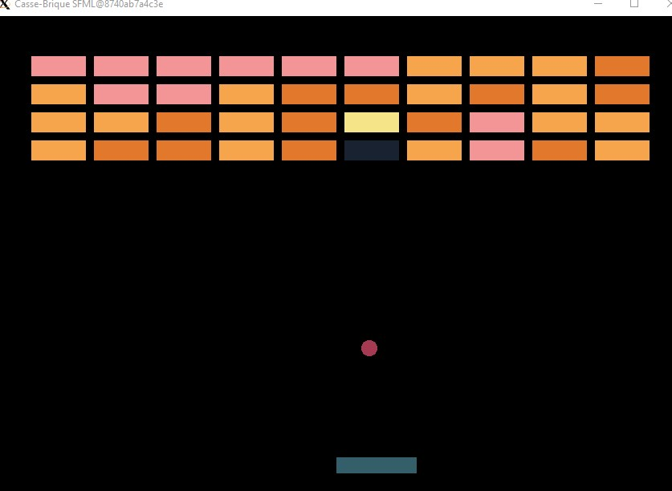
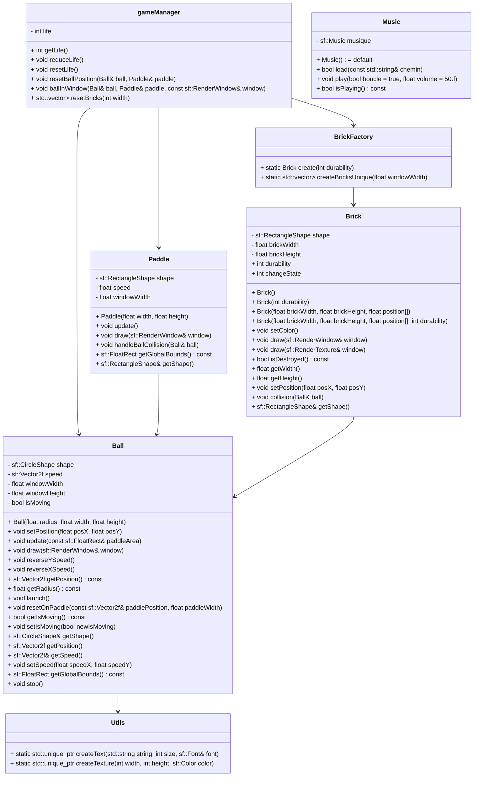

# BRICK-BREAKER



**Second year IT Bachelor group project** 📌  
create a brick breaker game with **C++ and SMFL and Docker**

---

### 🚀 Features

- 🎮 Classic brick breaker gameplay with paddle and ball
- 🧱 Dynamic brick generation and destruction
- 🧑‍💻 Modular code structure (GameManager, Paddle, Ball, BrickFactory…)
- 🐳 Dockerized build and execution (cross-platform)

---

### 🛠️ Technologies

- 💻 C++17
- 🖼️ SFML (Graphics)
- ⚙️ CMake
- 🐳 Docker & Docker Compose

<hr style="height: 4px; background-color: #0b9c5fff; border: none;">

## Conception : classes' diagram


## Project Structure

New project structure

```
📁 Brick Breaker
 ├── 📁 src
 │   ├── 📁 assets
 │   │   ├── 📁 fonts
 │   │   │   └── 📄 ARIAL.TTF
 │   │   ├── 📁 musics
 │   │   │   ├── 🎵 boogie.mp3
 │   │   │   └── 🎵 minecraft.mp3
 │   │   ├── colors.hpp
 │   │   ├── music.cpp
 │   │   ├── music.hpp
 │   │   └── values.hpp
 │   ├── 📁 brick
 │   │   ├── brick.cpp
 │   │   ├── brick.hpp
 │   │   ├── brickFactory.cpp
 │   │   └── brickFactory.hpp
 │   ├── 📁 gameObject
 │   │   ├── ball.cpp
 │   │   ├── ball.hpp
 │   │   ├── paddle.cpp
 │   │   └── paddle.hpp
 │   ├── gameManager.cpp
 │   ├── gameManager.hpp
 │   ├── main.cpp
 │   ├── main.hpp
 │   ├── utils.cpp
 │   └── utils.hpp
 ├── .gitignore
 ├── CMakeLists.txt
 ├── 🐳 Dockerfile
 ├── 📝 README.md
 ├── config.xlaunch
 └── ⚙️ docker-compose.yml
```

<hr style="height: 4px; background-color: #0b9c5fff; border: none;">

## Installation Guide

### Installs

If you're on windows, you'll need a software to get the GUI working. On linux X server does the job, on Windows you can either download and install `VcXsrv` or `Xming`. For this project, we'll be using `VcXsrv` on windows

### On Linux

I'll take care of instruction for linux later.

### On Windows

### 1. Install VcXsrv

### 1.1 Download VcXsrv from [https://vcxsrv.com/](https://vcxsrv.com/) or [https://github.com/marchaesen/vcxsrv](https://github.com/marchaesen/vcxsrv)

Download `vcxsrv-64.21.1.16.1.installer.exe`
Typical installation is fine (all components checked).

### 1.2 Configure and start VcXsrv

- Open XLaunch (installed with VcXsrv).
- Choose **“Multiple windows”** (so each SFML window appears separately).
- Display settings: **“Start no client”** (we just want to display Docker windows).

Extra settings:

- Check: **“Disable access control”** : ⚠️ this is important so Docker can connect without extra authentication.

Leave the rest as default.
Finish and start the server. You should see an X icon in your system tray.

If needed, you can use `config.xlaunch` where all config were saved.

### 1.3 Add environment configuration to docker-compose.yml

```
- DISPLAY=host.docker.internal:0
```

### 2. Set environment variable on powershell or CMD

⚠️ Set this environment variable on your host !!

```bash
set DISPLAY=host.docker.internal:0
```

or in WSL2

```bash
export DISPLAY=$(ip route | awk '/default/ {print $3}'):0
```

### 3. Build image

```bash
docker compose up --build -d
```

if image already build:

```bash
docker compose up
```

If you wanna check which version of SFML you're using :

```bash
docker compose exec dev bash -c "dpkg -l | grep libsfml"
```

### 4. Start project

⚠️ Before starting project, execute `config.xlaunch` or start `XLaunch` service : without it you won't be able to forward SMFL from container to host.

```bash
docker compose up
```

`docker-compose.yml` already set the following command `bash -ic "cmake -S . -B build && cmake --build build && ./build/$MAIN_FILE_NAME"` , this command will build and run the project. You can change the file name in the docker-compose

Do it manually (if the container is already running)

```bash
docker compose exec dev bash -c "cmake -S . -B build && cmake --build build && ./build/sfml-test"
```

replace ./build/sfml-test to the name of your executable (cf CMakeLists.txt last line add_executable)

```bash
docker compose exec dev bash -c "rm -rf build/*"
```

<hr style="height: 4px; background-color: #0b9c5fff; border: none;">
  
# Contributing  
  
This project was made by:  
  
- [Thibault Caron](https://github.com/thibault-caron)  
- [Adeline Patenne](https://github.com/AdelinePat/)  
- [Florence Navet](https://github.com/florence-navet)  
  
### Licence  
  
This project is licensed under the MIT License.  
  
---
