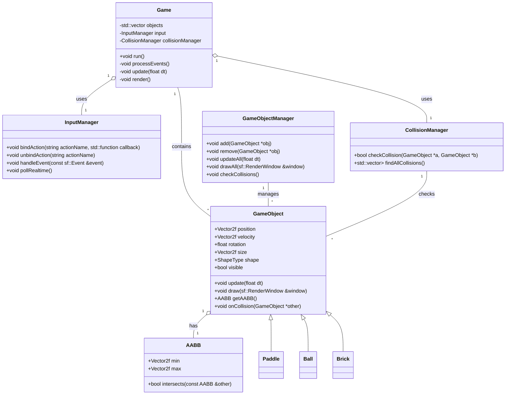

# Class Diagram

# Explanations

- Game / GameObject: contain update and rendering logic. Objects can be either a circle or a rectangle (via shape or derived classes) and expose an AABB for collision.

- AABB: axis-aligned bounding box used for intersection tests.

- CollisionManager / GameObjectManager: help detect and manage collisions between objects.

- InputManager: centralizes listening to SFML events and binding actions to callbacks (e.g. left click -> "shoot", key 'E' -> "explode").