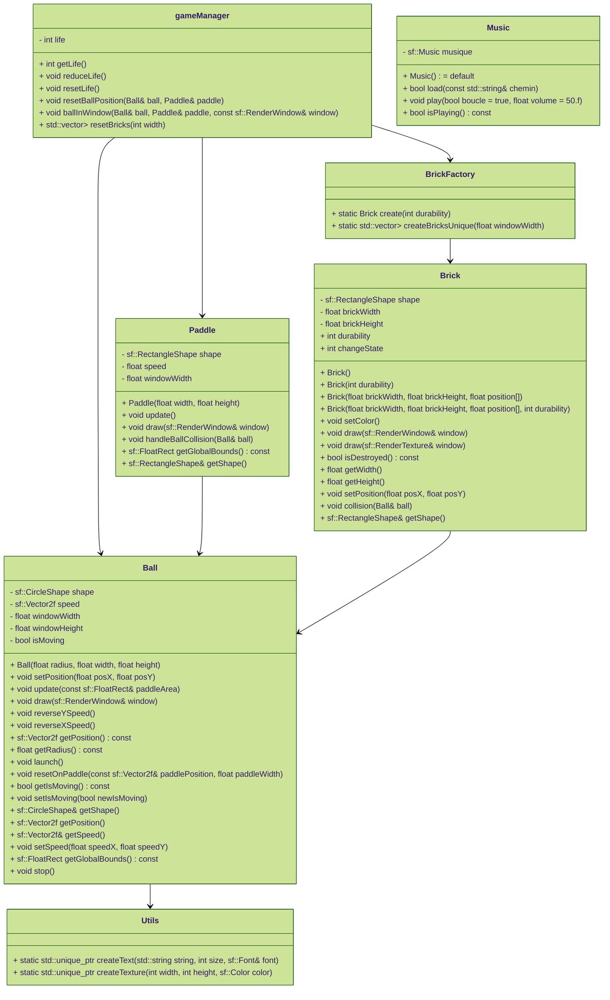

# Brick Breaker Class Diagram

```mermaid
%%{init:{'theme':'forest'}}%%
classDiagram
    class gameManager {
        - int life
        + int getLife()
        + void reduceLife()
        + void resetLife()
        + void resetBallPosition(Ball& ball, Paddle& paddle)
        + void ballInWindow(Ball& ball, Paddle& paddle, const sf::RenderWindow& window)
        + std::vector<std::unique_ptr<Brick>> resetBricks(int width)
    }
    class Ball {
        - sf::CircleShape shape
        - sf::Vector2f speed
        - float windowWidth
        - float windowHeight
        - bool isMoving
        + Ball(float radius, float width, float height)
        + void setPosition(float posX, float posY)
        + void update(const sf::FloatRect& paddleArea)
        + void draw(sf::RenderWindow& window)
        + void reverseYSpeed()
        + void reverseXSpeed()
        + sf::Vector2f getPosition() const
        + float getRadius() const
        + void launch()
        + void resetOnPaddle(const sf::Vector2f& paddlePosition, float paddleWidth)
        + bool getIsMoving() const
        + void setIsMoving(bool newIsMoving)
        + sf::CircleShape& getShape()
        + sf::Vector2f getPosition()
        + sf::Vector2f& getSpeed()
        + void setSpeed(float speedX, float speedY)
        + sf::FloatRect getGlobalBounds() const
        + void stop()
    }
    class Paddle {
        - sf::RectangleShape shape
        - float speed
        - float windowWidth
        + Paddle(float width, float height)
        + void update()
        + void draw(sf::RenderWindow& window)
        + void handleBallCollision(Ball& ball)
        + sf::FloatRect getGlobalBounds() const
        + sf::RectangleShape& getShape()
    }
    class Brick {
        - sf::RectangleShape shape
        - float brickWidth
        - float brickHeight
        + int durability
        + int changeState
        + Brick()
        + Brick(int durability)
        + Brick(float brickWidth, float brickHeight, float position[])
        + Brick(float brickWidth, float brickHeight, float position[], int durability)
        + void setColor()
        + void draw(sf::RenderWindow& window)
        + void draw(sf::RenderTexture& window)
        + bool isDestroyed() const
        + float getWidth()
        + float getHeight()
        + void setPosition(float posX, float posY)
        + void collision(Ball& ball)
        + sf::RectangleShape& getShape()
    }
    class BrickFactory {
        + static Brick create(int durability)
        + static std::vector<std::unique_ptr<Brick>> createBricksUnique(float windowWidth)
    }
    class Utils {
        + static std::unique_ptr<sf::Text> createText(std::string string, int size, sf::Font& font)
        + static std::unique_ptr<sf::RenderTexture> createTexture(int width, int height, sf::Color color)
    }
    class Music {
        - sf::Music musique
        + Music() = default
        + bool load(const std::string& chemin)
        + void play(bool boucle = true, float volume = 50.f)
        + bool isPlaying() const
    }

    gameManager --> Ball
    gameManager --> Paddle
    gameManager --> BrickFactory
    BrickFactory --> Brick
    Ball --> Utils
    Paddle --> Ball
    Brick --> Ball
```