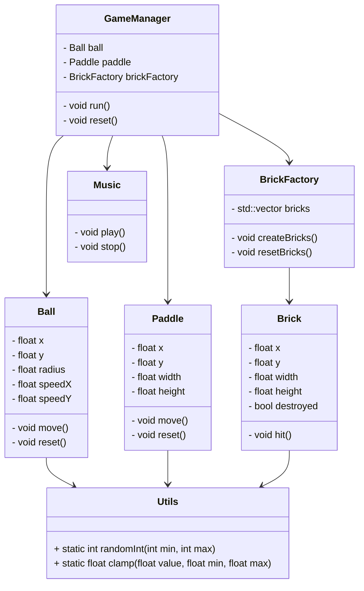

# Final Class Diagram

```mermaid
classDiagram
    class GameManager {
        - Ball ball
        - Paddle paddle
        - BrickFactory brickFactory
        - void run()
        - void reset()
    }
    class Ball {
        - float x
        - float y
        - float radius
        - float speedX
        - float speedY
        - void move()
        - void reset()
    }
    class Paddle {
        - float x
        - float y
        - float width
        - float height
        - void move()
        - void reset()
    }
    class Brick {
        - float x
        - float y
        - float width
        - float height
        - bool destroyed
        - void hit()
    }
    class BrickFactory {
        - std::vector<Brick> bricks
        - void createBricks()
        - void resetBricks()
    }
    class Utils {
        + static int randomInt(int min, int max)
        + static float clamp(float value, float min, float max)
    }
    class Music {
        - void play()
        - void stop()
    }
    GameManager --> Ball
    GameManager --> Paddle
    GameManager --> BrickFactory
    BrickFactory --> Brick
    Ball --> Utils
    Paddle --> Utils
    Brick --> Utils
    GameManager --> Music
```

This diagram summarizes the main classes and their relationships based on the project source files. Associations and key methods/fields are included for clarity.